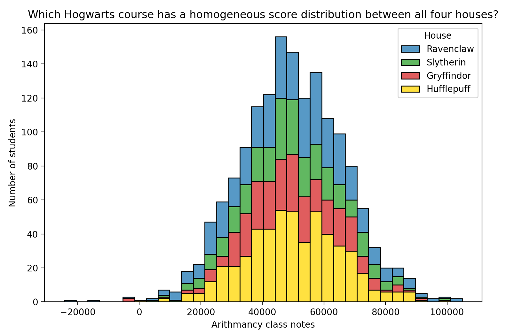
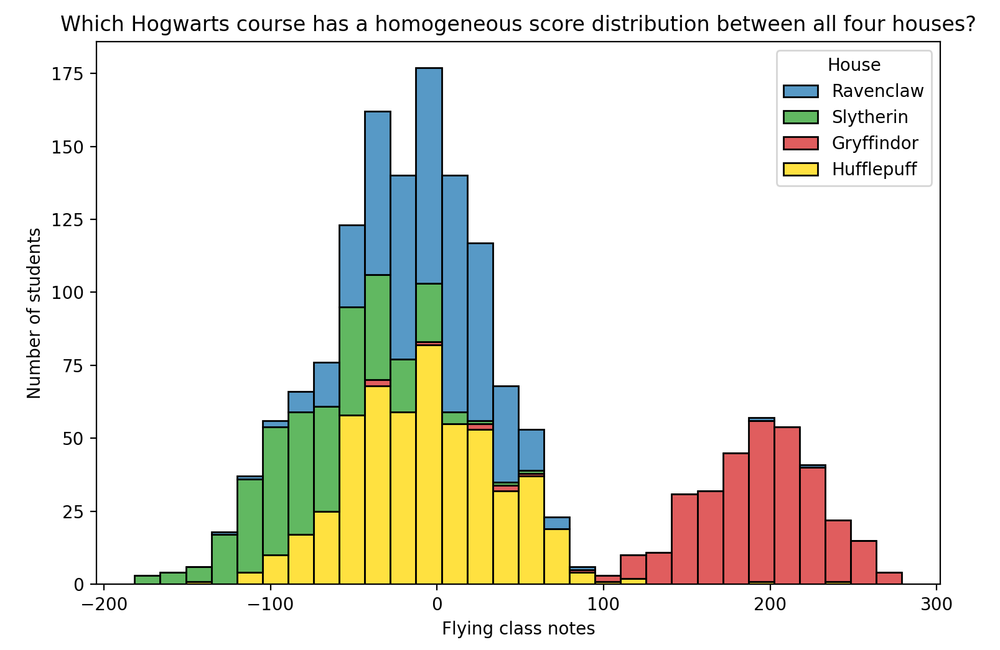
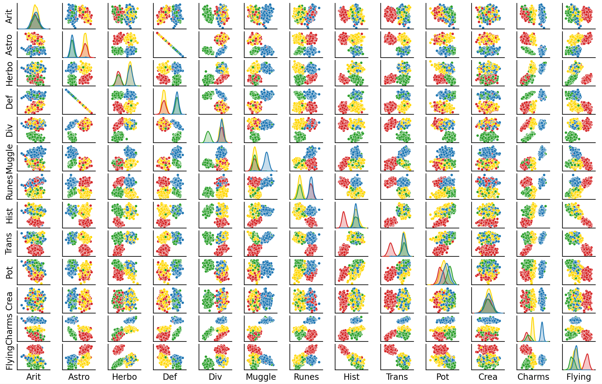

# DSLR

This project is an introduction to data science notions through a logistic regression task. 

In this project, a logistic regression programs will be trained to classifiy data.

Specifically, it will assign students of Hogwards into the 4 houses.

Our database contains information on the pre-existing students grades in different courses and their respective houses.

In reference to said database, our program will determine the most suitable house to assign to a new incoming student, based on their scores in the various courses.

Our project requires a heavy load of calculations. Therefore, we put a lot of thought into optimizing calculations, such as using matrix operations or table calculations. Graphs will also be generated to visualize results for an easier comprehension of the analyzed data.

We chose Python for its several graphical libraries, its advantage for matrix calculations, and its data science-oriented libraries (for calculations of tables). We felt that naturally, it would be the best choice for this project.

---

## Table of Contents

1. [Architecture](#architecture)
2. [Analysis](#analysis)
3. [Training](#training)
3. [Prerequisites](#prerequisites)
4. [Installation](#installation)
5. [Usage](#usage)

---
## Architecture

Python is an object-oriented language. Thus, our project was structured as follows:
Makefile: contains saved commands for demonstration purposes

Class folder: contains all class files

Script folder: contains all scripts

Data folder: contains database

Test folder: contains python files that tests the functionality and efficiency of the program


This project consists of two aspects: analysis and machine learning.

First, we will analyze the dataset and select noteworthy variables that will be used to separate the students into groups. Then, the machine learning section of the program will train and produce predictions.

scripts for analysis :
   describe.py
   histogram.py
   pair_plot.py

scripts for train and use our models :
   logreg_train.py
   logreg_predict.py

---
## Analysis

The purpose of the analysis is to identify useful features for training the algorithm.

### 1. Histograms
For each subject, a histogram will be generated from the referenced dataset to show the relation of the students scores of said subject and their corresponding house types.

Subject scores that result in a homogeneous distribution of the students (figure 1) are less likely to be significant for the classification, and will be omitted from the training.



On the other hand, subjects that result in distributions such as shown below (figure 2) have more value in determining the classification of the students, and will be emphasized during the training.



### 2. Scatter plots

A scatter plot is a type of data visualization that uses points to represent the values of two variables in a Cartesian coordinate system. Each point corresponds to an observation in the dataset

For every possible pair of subject scores, a scatter plot will be generated. These plots allow us to determine the correlation between each pair of variables. To avoid data redundancy, one of the variables that show significant correlation will be omitted in the algorithm.


---

## Training

After analyzing and screening for significant variables. These variables will be used to train the program to classify the students into their houses.

4 Logistic Regressions will be created, one for each house. Each will us the probability of a student belonging to that house.

1. Initialization
    
    The weights of our algorithms are initialized to 0, and are updated as the program undergoes its training.
    
2. Calculation of **Loss**
    
    The first predictions will be made, and will be compared to the actual values in the dataset. **Loss** measures the difference between the predicted values and the true values.
    
3. Adjustments to Weights
    
    Based on the value of **Loss**, the model’s weights are adjusted to improve accuracy. This process is known as **gradient descent**, where the weights are updated to minimize the Loss.
    
4. Repitition
    
    This process will be repeated multiple times, iteratively reducing the Loss, until further improvement is no longer possible or changes become negligible. Now, our model will have optimized weights, and will be able to produce accurate predictions of the house of any given student.
    
5. Partial Derivation of **Loss**
    
    The partial derivative of **Loss** will tell us whether each weight should be diminished or amplified. Then, we continue to update our weights to increase the accuracy of the predictions.
    
6. Verdict
    
    Now, we have 4 scores (for each house), ranging from 0 to 1, indicating the possibilities that the given student belongs to said houses.
    
    Obviously, the house that corresponds to the highest score of the 4 is the house that the student will be assigned to and we save predictions in a houses.csv file in the out folder.

---

## Prerequesites

This project uses [Conda](https://docs.conda.io/projects/conda/en/latest/user-guide/install/index.html) to manage dependencies. Please ensure you have Conda installed before proceeding using the following command line:

```bash
   conda --version
```

---

## Installation

### 1.Clone the repository

Clone this repository to your local machine using the following command:

```bash
git clone git@github.com:pcheron-root/dslr.git
cd dslr
```

### 2.Install and activate the conda environment

Create the environment using the `environment.yml` file, which specifies all dependencies for this project.

```bash
conda env create -f environment.yml -n your_envname
```

Activate the environment:

```bash
conda activate your_envname
```

### 3. Verify the installation (Optional)

To confirm that all dependencies are installed, you can list installed packages:

```bash
conda list
```

---

## Usage

After setting up the environment, you can run the project using the Makefile:

```bash
make hist

make pair

make train

make predict

make E2E
```
